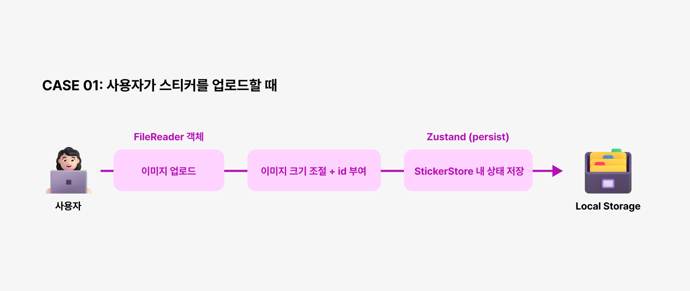
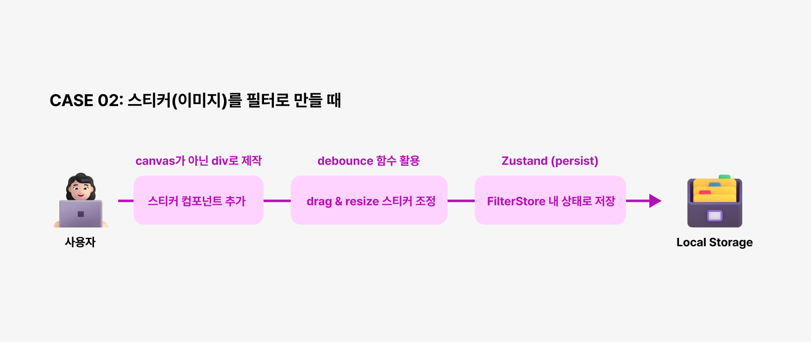
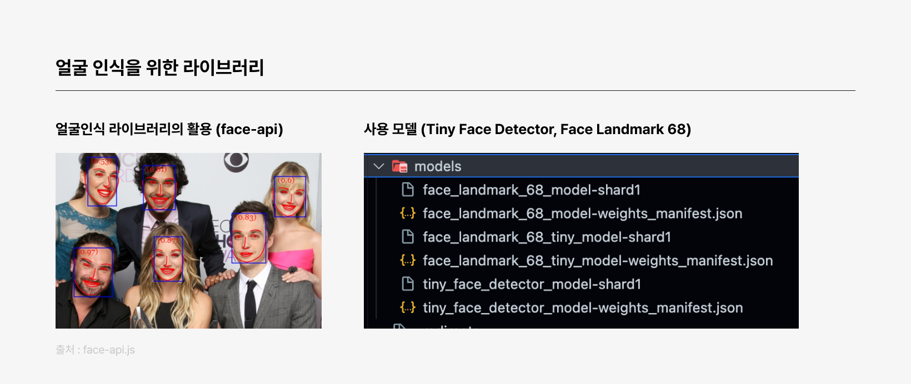
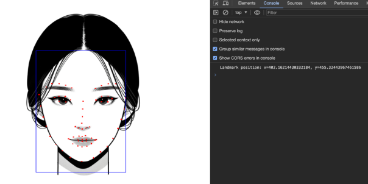
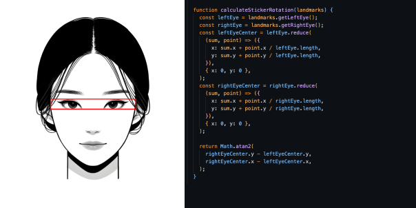

# Kitsch-Catchy


<br />

<center>

서비스가 궁금하시다면 링크를 눌러주세요. [Kitsch Catchy Website](https://kitschcatchy.doitchuu.dev/)
| [Notion](https://kitschcatchy.doitchuu.dev/)

</center>

<br />
<br />
<br />

# 1. Service Introduction

## 💡 Motivation

Z세대를 대표하는 말 중 포토 프레스 세대라는 말이 있습니다. 포토 프레스 세대인 Z세대 사용자들은 네컷 사진, AI필터나 IOS의<br />
포토 부스 앱 등을 활용해 사진을 찍기도 하고, 심지어 인스타 스토리나 사진도 그냥 찍지 않고 필터도 직접 만들어 공유하고 사용합니다.

> 포토프레스 세대?<br />
> Photo + Express를 더한 말로 사진을 통해 자신을 기록하고 표현하는 특성을 지닌 Z세대를 말합니다.


<br />

해당 트렌드에 영감을 받은 서비스 "Kitsch Catchy"는 **사용자가 원하는 이미지를 업로드하여**
**사진 필터를 만들고, 인식된 얼굴에 필터를 매핑해 사진을 찍을 수 있는 PC 웹 서비스**입니다.

<br />

## 🚀 Stacks

### FrontEnd

<div style="display:flex;">
  
  
  
  
  
  
</div>

### Tools (test & deployment)

<div style="display:flex;">
  
  
    
  
  
</div>

<br />
<br />
<br />

# 2. Feature

Kitsch Catchy 서비스의 주요 기능은 아래와 같습니다.

큰 맥락으로는 사용자 커스텀 필터를 제작하고,필터를 활용해<br />
실시간 웹 캠에서 사진을 촬영하고 저장할 수 있는 기능으로 나눌 수 있습니다.

<br />

## ✂️ 사용자 커스텀 필터 제작

### 1) 이미지 업로드


- 사용자는 기존에 등록되어있는 스티커 이외에도 로컬 파일에 저장된 이미지를 업로드할 수 있습니다.

<br />

### 2) 이미지(스티커) 이동 및 크기 조절


- 사이드바 영역에서 이미지(스티커) 혹은 템플릿 스티커를 클릭하면 마우스를 이용해 이미지를 드래그해 얼굴 샘플 이미지 영역 내 원하는 위치에 붙일 수 있습니다.
- 각 이미지의 모서리 영역을 클릭 후 드래그할 경우 이미지 비율에 맞게 크기를 조정할 수 있습니다.

<br />

### 3) 사진 필터 등록 및 삭제


- 얼굴 샘플 이미지 영역 내 위치시킨 스티커들의 위치(x, y 좌표), z-index, 크기(width, height), src 등의 정보를 저장해 사진 필터를 등록할 수 있습니다.
- 추후 필터 공유를 위해 사용자가 직접 필터명을 적고 저장할 수 있도록 필터명을 입력하는 기능이 있습니다.

<br />

## 📸 필터를 활용한 사진 촬영

### 1) 실시간 웹 캠 내 얼굴 인식 및 필터 맵핑


- 필터 저장 후, 실시간 웹캠 권한이 허용되면 웹캠이 활성화되고, 캔버스 내에서 얼굴 인식에 맞춰 사진 필터가 매핑됩니다.
- 얼굴의 각도와 웹 캠 간의 거리에서 얼굴의 크기에 맞게 스티커의 각도나 크기가 조정되어 얼굴에 부착됩니다.

<br />

### 2) 사진 촬영 및 로컬 내 촬영 이미지 저장


- 사용자가 촬영 버튼을 클릭하면 3초의 타이머가 설정되며, 이 후 웹캠 화면이 캡처됩니다.
- 캡쳐한 화면이 나오면 웹 캠과 캔버스가 멈추고 해당 사진을 사용자의 로컬 환경에 저장할 수 있습니다.

<br />

그 외 기능들은 로그인 없이 웹사이트에서 확인하실 수 있습니다.

<br />
<br />

# 3.Challenge

## ☁️ 사용자가 업로드한 이미지를 어떻게 필터로 만들고 저장할까?



사용자가 이미지(스티커)를 업로드하면 `FileReader` 객체를 통해 이미지를 읽습니다. 업로드한 이미지 객체를 생성해 크기를 측정한 후,<br />
`nanoid`를 사용하여 각 스티커에 고유 ID를 부여하고 이 상태들을 Zustand를 활용해 로컬 스토리지에 저장했습니다.

<br />

### 1) 필터를 만들기 위해 사용자가 매번 이미지를 등록해야 할까?

#### useStickerStore 예시

```jsx
const useStickerStore = create(
  persist(
    (set) => ({
      stickers: [],
      addSticker: (sticker) =>
        set((state) => ({
          stickers: [{ ...sticker, id: nanoid(10) }, ...state.stickers],
        })),
      deleteSticker: (id) =>
        set((state) => ({
          stickers: state.stickers.filter((sticker) => sticker.id !== id),
        })),
    }),
    {
      name: "sticker-storage",
      getStorage: () => localStorage,
    }
  )
);
```

상태를 저장하기 위해 쓰인 `Persist` 메소드는 Zustand 라이브러리에서 제공하는 기능으로, 상태 관리 시스템에 저장된 데이터를 브라우저의 로컬 스토리지에 영구적으로 저장합니다.

이를 통해 애플리케이션을 재시작하거나 브라우저를 닫았다가 다시 열어도 이전 상태를 유지해 스티커와 필터를 저장해 사용자가 다른 필터를 만들더라도 사용성을 높였습니다.

<br />

### 2) 스티커를 붙일 때도 캔버스를 써야할까?



저장된 스티커들을 불러와 사용자가 직접 필터를 디자인할 수 있는 환경을 제공하기 위해 캔버스를 활용하지 않고, 스티커 컴포넌트로 따로 제작했습니다.

<br />

#### FilterSticker 컴포넌트 구조

```jsx
 	<StickerWrapper
		x={newPosition.x}
		y={newPosition.y}
		width={newSize.width}
		height={newSize.height}
		zIndex={zIndex}
		selected={selected}
		onMouseDown={onMouseDown}
 >
	 
	 {selected && (
	    <>
		   <SelectedSticker data-resize="true" className="bottom-right" />
	     <SelectedSticker data-resize="true" className="bottom-left" />
       <SelectedSticker data-resize="true" className="top-right" />
       <SelectedSticker data-resize="true" className="top-left" />
       <CloseButton onClick={() => onDelete(id)}>x</CloseButton>
      </>
	  )}
		</StickerWrapper>
	 );
 }
```

스티커를 캔버스에 이미지를 추가하는 방식으로 구현하지 않고 별도의 컴포넌트로 구현하는 방식은 React 문서에 따르면,<br />
React는 UI를 독립적이고 재사용 가능한 부분으로 나누어 관리하는 것을 권장하는 것에 부합하며 추가로 아래와 같은 이점이 있었습니다.

1. 컴포넌트 방식은 React의 상태 관리 로직을 활용하여 스티커의 위치와 크기 변화를 추적하고,<br />
   상태 변경에 따른 UI 갱신을 효율적으로 관리할 수 있습니다.
2. 각 스티커를 독립된 컴포넌트로 만듦으로써 **코드의 재사용성과 유지보수성**이 향상될 수 있습니다.
3. **동적으로 많은 요소를 다룰 때 React의 성능 최적화 기능( Virtual DOM)을 이용**하여<br />
   캔버스에 직접적으로 그릴 때보다 더 나은 렌더링 성능을 기대할 수 있습니다.

<br />

→ 이러한 점들을 고려하여 스티커(이미지)를 컴포넌트로 구현하였고, 동적으로 스티커 요소들을 조작할 때 사용자가 이용하는 것에 불편함을 느끼지 않도록 설계했습니다.

<br />

### 3) 스티커를 옮기거나 리사이징할 때마다 발생하는 리렌더링을 어떻게 최적화할까?

```jsx
const onMouseDown = debounce((event) => {
  event.stopPropagation();

  onSelect(id);

  if (event.target.dataset.resize) {
    updateFilterSticker(id, { size: newSize });
    setResizing(true);
  } else {
    updateFilterSticker(id, { position: newPosition });
    setDragging(true);
  }
}, TIME.DELAY);
```

> **Debounce ?**<br />
> Debounce는 이벤트가 마지막으로 호출된 후 일정 시간이 지나야만 함수를 실행합니다. <br />
> 즉, 연속적인 이벤트 호출이 있을 때, 마지막 호출이 끝난 후 일정 시간이 지나야 실행됩니다.

`debounce` 함수를 활용해 스티커의 드래그 및 리사이즈 이벤트를 최적화했습니다. 사용자는 스티커를 자유롭게 이동시키거나 크기를 조절할 수 있으며, 선택한 스티커는 주어진 `z-index`에 따라 렌더링되게끔 `z-index`를 업데이트를 하는 코드들은 모두 해당 작업들이 일어나고 마지막에 변경된 값만 Store에 업데이트 되도록 설정했습니다.

이를 통해 사용자가 스티커를 드래그하거나 리사이징 작업을 마치고 나서 상태 업데이트 처리를 해 스티커 컴포넌트 상태의 가장 마지막 속성들만 업데이트 되도록 설계했습니다.

<br />

## 👩 어떻게 실시간으로 인식되는 얼굴 영역에 스티커 위치와 각도를 알맞게 붙일까?



### 1) 얼굴인식 라이브러리를 활용하자! (face-api)

face-api.js는 브라우저 기반의 TensorFlow.js 라이브러리로, 빠르고 정확한 얼굴 감지 및 랜드마크 감지 기능을 제공하고 있습니다.<br />
스마트폰과 달리 테이블 위에 두고 정적으로 PC로 찍기 때문에 실시간으로 얼굴 감지가 잘되는 face-api.js를 활용하기로 했습니다.

#### 라이브러리 내 사용 모델

- Tiny Face Detector : 작고 빠르면서도 효과적인 얼굴 감지 기능을 제공하는 모델. 리소스가 제한적인 환경에서도 효율적으로 작동하며, 빠른 성능을 최적화할 수 있는 모델입니다.
- Face Landmark 68 Model : 얼굴의 68개 주요 랜드마크 포인트를 감지하는 모델. 얼굴의 눈, 코, 입 등의 위치를 정밀하게 파악하여, 스티커나 그래픽을 얼굴에 정확히 매핑하는 데 사용합니다.

<br />

| 샘플 이미지의 얼굴 중심점과 바운딩 박스 크기 측정                 | 얼굴 각도 측정을 위해 양쪽 눈 좌표 각도 계산              |
| ----------------------------------------------------------------- | --------------------------------------------------------- |
|  |  |

<br />

### 2) 얼굴 샘플 이미지에 있는 스티커를 사용자 얼굴에 잘 맞게 옮기려면?

먼저 얼굴 샘플 이미지를 동일한 모델로 인식시키고 해당 샘플 이미지의 바운딩 박스 및 중심점을 찾았습니다.찾은 이후, 아래와 같은 방식으로 로직을 세워 사용자의 얼굴에 스티커가 잘 매핑되도록 설계했습니다.

- **얼굴 중심점과 바운딩 박스 크기 측정**: 샘플 이미지에서 얼굴 중심점(**`x=402.16, y=455.32`**)과 바운딩 박스 크기(**`width=389.13, height=529.44`**)를 측정합니다.
- **스티커 위치 조정**: 샘플 이미지의 800x800 크기에 대한 각 스티커의 상대적 위치를 계산하고, 실시간 얼굴 인식 결과에 따라 이 위치를 조정합니다.
- **스티커 크기 조정**: 샘플 이미지의 얼굴 바운딩 박스에 대한 스티커의 상대적 크기를 계산하고, 실시간 얼굴 인식 결과의 바운딩 박스 크기에 따라 스티커 크기를 조정합니다.
- **스티커 렌더링**: 조정된 스티커를 실시간 비디오에 렌더링합니다.

<br />

### 3) 스티커의 각도와 얼굴의 각도는 어떻게 맞출까?

```jsx
function calculateStickerRotation(landmarks) {
  const leftEye = landmarks.getLeftEye();
  const rightEye = landmarks.getRightEye();
  const leftEyeCenter = leftEye.reduce(
    (sum, point) => ({
      x: sum.x + point.x / leftEye.length,
      y: sum.y + point.y / leftEye.length,
    }),
    { x: 0, y: 0 }
  );
  const rightEyeCenter = rightEye.reduce(
    (sum, point) => ({
      x: sum.x + point.x / rightEye.length,
      y: sum.y + point.y / rightEye.length,
    }),
    { x: 0, y: 0 }
  );

  return Math.atan2(
    rightEyeCenter.y - leftEyeCenter.y,
    rightEyeCenter.x - leftEyeCenter.x
  );
}
```

`calculateStickerRotation`함수를 통해 스티커의 회전도를 조정합니다. 회전 값 은 얼굴의 두 눈(왼쪽과 오른쪽)의 중심 좌표를 계산하여 얻은 각도에 맞춰 스티커(이미지)를 붙입니다. 눈의 좌표를 통해 얼굴이 기우는 각도를 조정해 스티커의 각도도 동일하게 맞추도록 문제를 해결했습니다.

<br />

## 🎨 끊겨보이는 캔버스 내 이미지를 어떻게 최적화해서 보여줄까?

애니메이션 화면은 짧은 시간 간격에 이어지는 장면을 보는 것과 같은데 이 장면을 `frame`이라 합니다. 특정 시간 내 보여지는 `frame`의 갯수를 fps(frame per second)라고 하는데 대부분의 기기들은 시각적으로 부드럽게 느끼게 하기 위해 초당 60번 화면을 다시 그리도록 설계됩니다.

kitsch catchy 서비스에서도 사용자가 사진을 찍을 때 인식된 얼굴에 맞게 스티커가 매핑되는 과정들을 부드럽게 표현하기 위해 `requestAnimationFrame`을 활용했습니다.

<br />

> `requestAnimationFrame` ?<br />
> 브라우저의 리프레시 사이클과 동기화되어 애니메이션을 부드럽게 표시하는데 사용됩니다. 브라우저가 최적화된 시점에 애니메이션을 업데이트하는 방법을 활용해 화면의 깜빡임이나 지연을 최소화시킵니다.

<br />

#### requestAnimationFrame만 활용했을 때


<br />

`requestAnimationFrame`를 사용하기 전보다는 애니메이션을 표현하는 것에 있어 부드러워졌지만 스티커의 깜빡임이나 화면의 잔상이 남아있었습니다. 실시간으로 얼굴 인식이 되고 렌더링에 성능을 최적화하기 힘든 요소들이 많은 비디오 기반의 실시간으로 그래픽 처리를 최적화하는 방법을 찾게 되었습니다.

부동 소수점 좌표를 피하기 위해 `Math.floor`를 활용해 최대한 정수를 활용하고 얼굴 인식과 스티커 이미지 두 가지 내에서 canvas를 중복으로 활용해야 했기 때문에 공식 문서에서 추천하는 방식 중 `OffscreenCanvas`를 활용했습니다.

<br />

```jsx
useEffect(() => {
  offScreenCanvasRef.current = new OffscreenCanvas(
    videoRef.current.videoWidth || 1200,
    videoRef.current.videoHeight || 800
  );

  const offScreenContext = offScreenCanvasRef.current.getContext("2d", {
    willReadFrequently: true,
  });

  filterStickers.forEach((sticker) => {
    if (!stickerImages.current[sticker.src]) {
      const image = new Image();
      image.src = sticker.src;
      image.onload = () => {
        stickerImages.current[sticker.src] = image;
        offScreenContext.drawImage(image, 0, 0);
      };
    }
  });
}, [filterStickers]);
```

<br />

제 코드 내에서는 `videoRef`에서 비디오 스트림을 받아온 후, `OffscreenCanvas`를 생성하고 그에 맞는 컨텍스트를 설정했습니다.<br />
face-api를 사용하여 얼굴을 인식하고, 인식된 얼굴 데이터를 기반으로 `OffscreenCanvas`에 스티커를 렌더링해 메인 스레드의 부하를 줄이고,<br />
더 부드러운 사용자 경험을 제공하기 위해 사용했습니다.

<br />

#### OffscreenCanvas를 같이 활용했을 때


<br />

위의 gif 영상이 `OffscreenCanvas`를 활용한 모습입니다. 이전에 `requestAnimationFrame` 만 활용했을 때 보다는 훨씬 더 부드러워진 모습을 보실 수 있습니다.

<br />
<br />
<br />

# 4.프로젝트 회고

팀 프로젝트 이후 개인 프로젝트로 얼굴 인식이라는 생소한 기술을 활용한 아이디어를 내고 이를 구현해야 했을 때의 막막함이 기억납니다.코딩을 시작한 게 부트캠프가 시작되기 한달 전이었을 때 처음 자바스크립트를 공부했던 막막함과 비슷했습니다.

기술 검증을 위해 face-api를 활용해 실시간 비디오처리 중 원하는 위치에 이미지를 붙여 사용자의 얼굴에 맞게 기술 구현이 가능한 지 확인하고 프로젝트를 진행하면서 하나씩 기능이 구현되는 과정을 겪으며, 개발의 재미와 목표를 얻었습니다.

기획 프로젝트를 진행하고 디자이너로 디자인 프로젝트를 진행하면서 실제적으로 문제를 해결한다는 느낌을 느끼는 것에 갈증을 느꼈을 때 A-Z까지 직접 문제를 해결하고 싶었고 이번 솔로 프로젝트를 진행하면서도 문제들을 직접 스스로 해결하면서 가장 희열감을 느꼈던 것 같습니다.

개발자가 되고 스스로 문제점을 찾아내고 그 문제를 해결하는 방법을 고민하는 과정들을 겪으면서 프로젝트를 하면서 성장해가고 있구나를 느끼게 되어 좋았습니다. 리팩토링이나 필터 공유 기능 등의 추가적인 기능들과 디테일을 챙겨야할 것들은 많지만 이번 프로젝트를 하며 개발의 재미와 목표를 얻은 것 같아 뿌듯했고 회사에 들어가 협업을 하게 될 때에도 개인적으로 업무를 맡게 되는 경우도 많을 텐데 혼자 프로젝트를 진행하며 스스로 기능 구현을 하고 문제를 해결하기 위한 방법을 찾아가는 과정을 경험해본 것 같아 뜻깊은 프로젝트였습니다.

<br />
