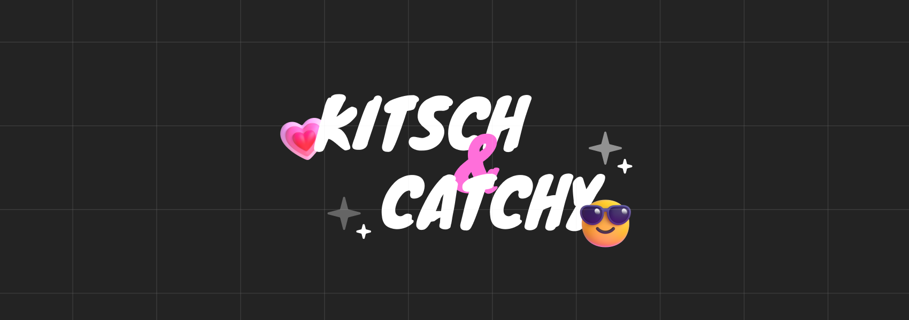
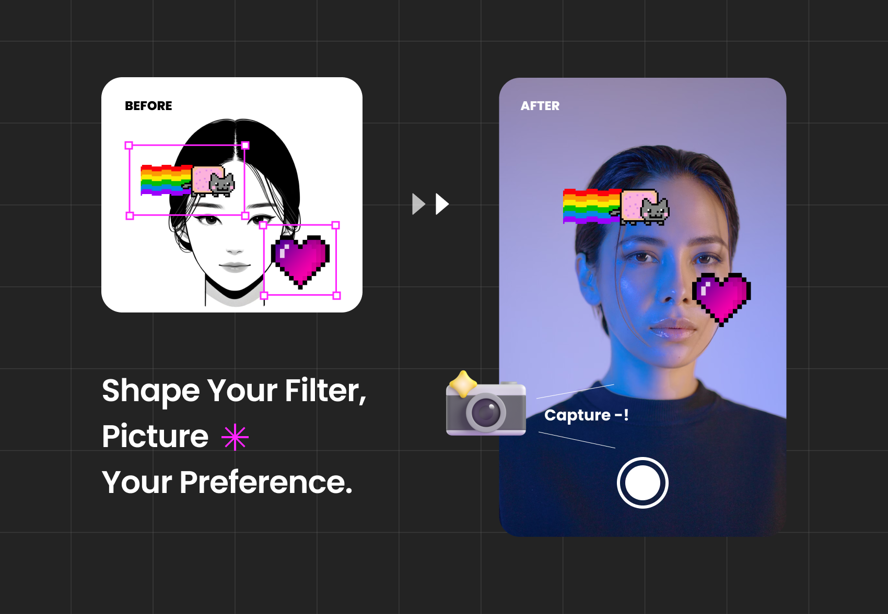
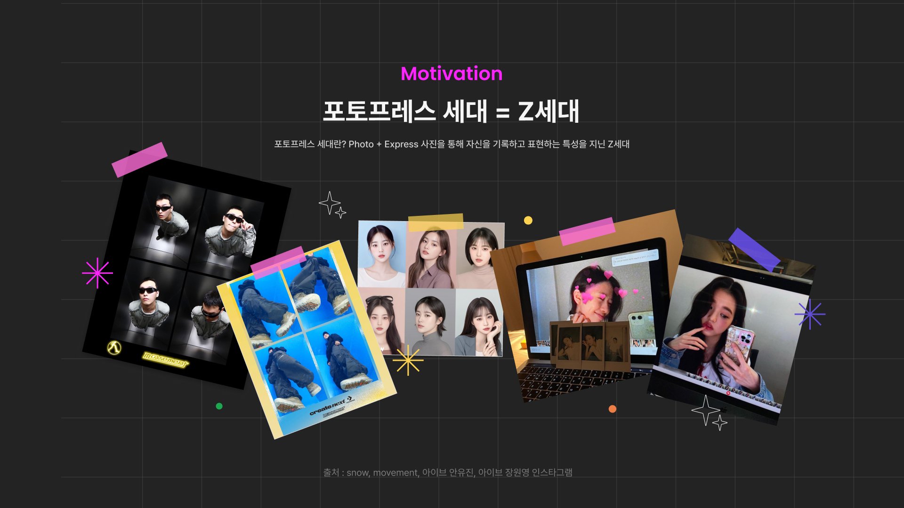
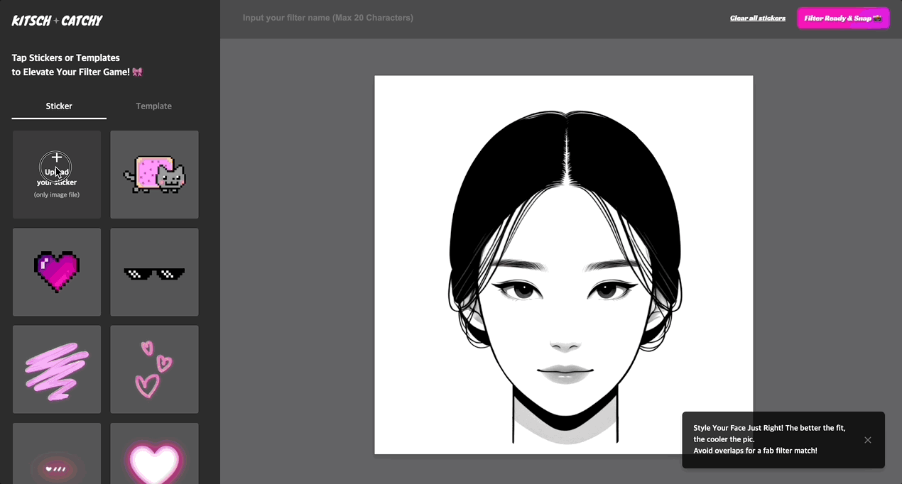
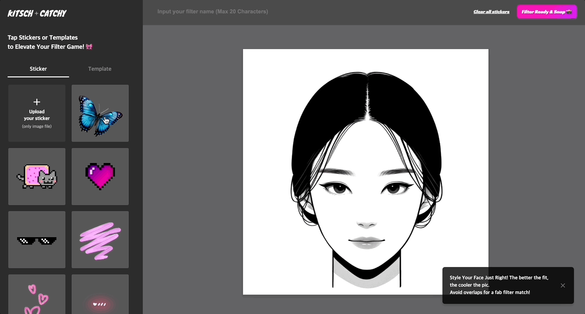
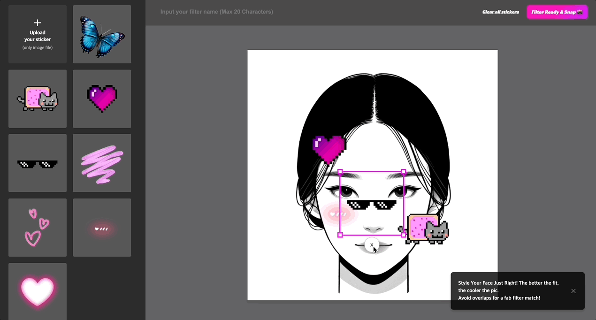

# Kitsch-Catchy

 

서비스가 궁금하시다면?
[Kitsch Catchy Website](https://kitschcatchy.doitchuu.dev/)
| [Notion](https://kitschcatchy.doitchuu.dev/)

 
 

# 1. Service Introduction

## 💡 Motivation

Z세대를 대표하는 말 중 포토 프레스 세대라는 말이 있습니다. 포토 프레스 세대인 Z세대 사용자들은 네컷 사진, AI필터나 IOS의 포토 부스 앱 등을 활용해 사진을 찍기도 하고, 심지어 인스타 스토리나 사진도 그냥 찍지 않고 필터도 직접 만들어 공유하고 사용하는 것에서 아이디어를 착안했습니다.

> 포토프레스 세대? 
> Photo + Express를 더한 말로 사진을 통해 자신을 기록하고 표현하는 특성을 지닌 Z세대를 말합니다.

 

해당 트렌드에 영감을 받은 서비스 "Kitsch Catchy"는 **사용자가 원하는 이미지를 업로드하고**
**사진 필터를 만들어 인식된 얼굴에 맞게 필터를 매핑해 사진을 찍을 수 있는 PC 웹 서비스**입니다.

 

## 🚀 Stacks

### FrontEnd

  
  
  
  
  
  

### Tools (test & deployment)

  
  
    
  
  

 
 
 

# 2. Feature

Kitsch Catchy 서비스의 주요 기능은 아래와 같습니다.

큰 맥락으로는 사용자 커스텀 필터를 제작하고,필터를 활용해 
실시간 웹 캠에서 사진을 촬영하고 저장할 수 있는 기능으로 나눌 수 있습니다.

 

## ✂️ 사용자 커스텀 필터 제작

### 1) 이미지 업로드

- 사용자는 기존에 등록되어있는 스티커 이외에 로컬 파일에 저장되어 있는 이미지를 업로드할 수 있습니다.

 

### 2) 이미지(스티커) 이동 및 크기 조절

- 사이드바 영역에서 이미지(스티커) 혹은 템플릿 스티커를 클릭하면 마우스를 이용해 이미지를 드래그해 얼굴 샘플 이미지 영역 내 원하는 위치에 붙일 수 있습니다.
- 각 이미지의 모서리 영역을 클릭 후 드래그할 경우 이미지 비율에 맞게 크기를 조정할 수 있습니다.

 

### 3) 사진 필터 등록 및 삭제

- 얼굴 샘플 이미지 영역 내 위치시킨 스티커들의 위치(x, y 좌표), z-index, 크기(width, height), src 등의 정보를 저장해 사진 필터를 등록할 수 있습니다.
- 추후 필터 공유를 위해 사용자가 직접 필터명을 적고 저장할 수 있도록 필터명을 입력할 수 있습니다.

 

## 📸 필터를 활용한 사진 촬영

### 1) 실시간 웹 캠 내 얼굴 인식 및 필터 맵핑

- 필터를 저장한 후 실시간 웹 캠 권한을 받으면 웹 캠이 켜지고 캔버스 영역 내 얼굴 인식에 맞게 사진 필터가 매핑됩니다.
- 얼굴의 각도와 웹 캠 간의 거리에서 얼굴의 크기에 맞게 스티커의 각도나 크기가 조정되어 얼굴에 부착됩니다.

 

### 2) 사진 촬영 및 로컬 내 촬영 이미지 저장

- 사용자가 촬영 버튼을 누르면 3초 간의 타이머를 설정해 3초 이후에 웹 캠 화면을 캡쳐합니다.
- 캡쳐한 화면이 나오면 웹 캠과 캔버스가 멈추고 해당 사진을 사용자의 로컬 환경에 저장할 수 있습니다.

 

그 외 기능들은 로그인 없이 웹사이트에서 확인하실 수 있습니다.

 
 

# Challenge
